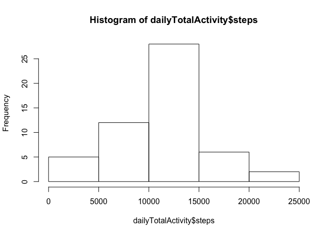
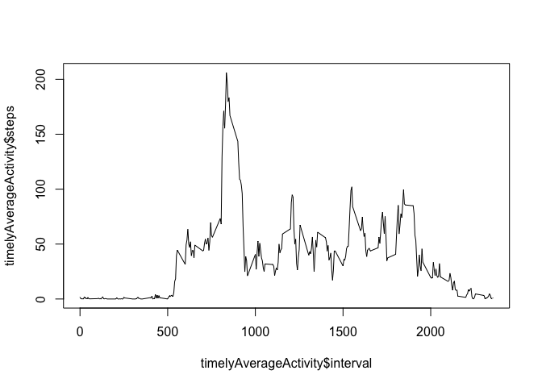
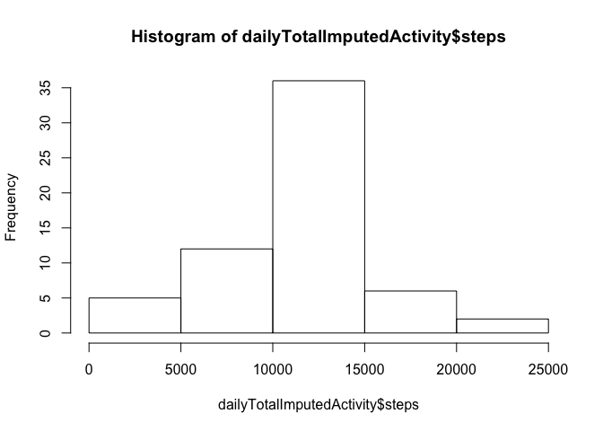
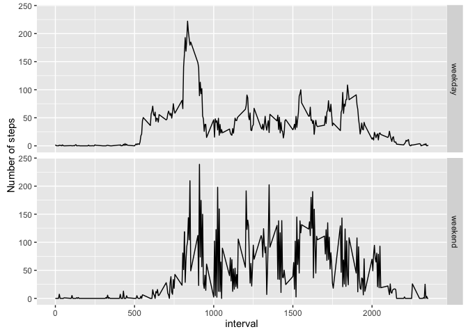

# Reproducible Research: Peer Assessment 1


## Loading and preprocessing the data


```r
activityData <- read.csv("activity.csv")  
dailyTotalActivity <- aggregate(steps ~ date, data=activityData, FUN=sum, na.action = na.omit)
```

## What is mean total number of steps taken per day?


```r
hist(dailyTotalActivity$steps)
```

<!-- -->

The mean total number of steps taken per day is calculated as follows: 

```r
originalMean <- mean(dailyTotalActivity$steps)
print(originalMean)
```

```
## [1] 10766.19
```

The median total number of steps taken per day is calculated as follows:

```r
originalMedian <- median(dailyTotalActivity$steps)
print(originalMedian)
```

```
## [1] 10765
```

## What is the average daily activity pattern?


```r
timelyAverageActivity <- aggregate(steps ~ interval, data=activityData, FUN=mean, na.action = na.omit)
plot(timelyAverageActivity$interval, timelyAverageActivity$steps, type="l")
```

<!-- -->

The maximum number of average steps in a 5-minute interval is calculated as follows:

```r
maxStepsInInterval <- max(timelyAverageActivity$steps)
```

This is the average number of steps that were recorded during the following 5-minute interval:

```r
timelyAverageActivity[timelyAverageActivity$steps == maxStepsInInterval,]$interval
```

```
## [1] 835
```

## Imputing missing values

In the orginal activity dataset, there were a large number of days recorded with no steps measured, as follows:


```r
nrow(is.na(activityData))
```

```
## [1] 17568
```

In order to replace the missing values in the activity dataset, I'll replace these step values with the average number of steps across all recorded steps per record.


```r
activityDataImputed <- activityData
activityDataImputed[is.na(activityData),1] <- mean(activityData$steps, na.rm=TRUE)
dailyTotalImputedActivity <- aggregate(steps ~ date, data=activityDataImputed, FUN=sum, na.action = na.omit)
```

Here is a graph of the dataset with imputed missing values and associated mean and median


```r
hist(dailyTotalImputedActivity$steps)
```

<!-- -->

The new mean total number of steps taken per day is calculated as follows: 

```r
imputedMean <- mean(dailyTotalImputedActivity$steps)
print(imputedMean)
```

```
## [1] 10766.19
```
Note that this value will be exactly equal to the original mean, since the original mean ignored missing values and now the missing values have been replaced by the mean.

The new median total number of steps taken per day is calculated as follows:


```r
imputedMedian <- median(dailyTotalImputedActivity$steps)
print(imputedMedian)
```

```
## [1] 10766.19
```


```r
print(if(imputedMedian == originalMedian)
        "Note that this is equal to the original median."
      else
        "Note that this is not equal to the original median.")
```

```
## [1] "Note that this is not equal to the original median."
```

## Are there differences in activity patterns between weekdays and weekends?


```r
activityData$dayType <-
  as.factor(
    ifelse (weekdays(as.Date(activityData$date)) == c("Saturday", "Sunday"),
      {"weekend"}, {"weekday"})
    )

dayTypeActivityTrends <- aggregate(steps ~ interval + dayType, data=activityData, mean, na.rm=TRUE)
```

Here's a plot showing the mean number of steps per interval on weekdays vs. weekend days


```r
library(ggplot2)
```

```
## Warning: package 'ggplot2' was built under R version 3.2.4
```

```r
qplot(interval, steps, data=dayTypeActivityTrends, facets = dayType ~ .,
  geom=c("line"), ylab="Number of steps") 
```

<!-- -->
